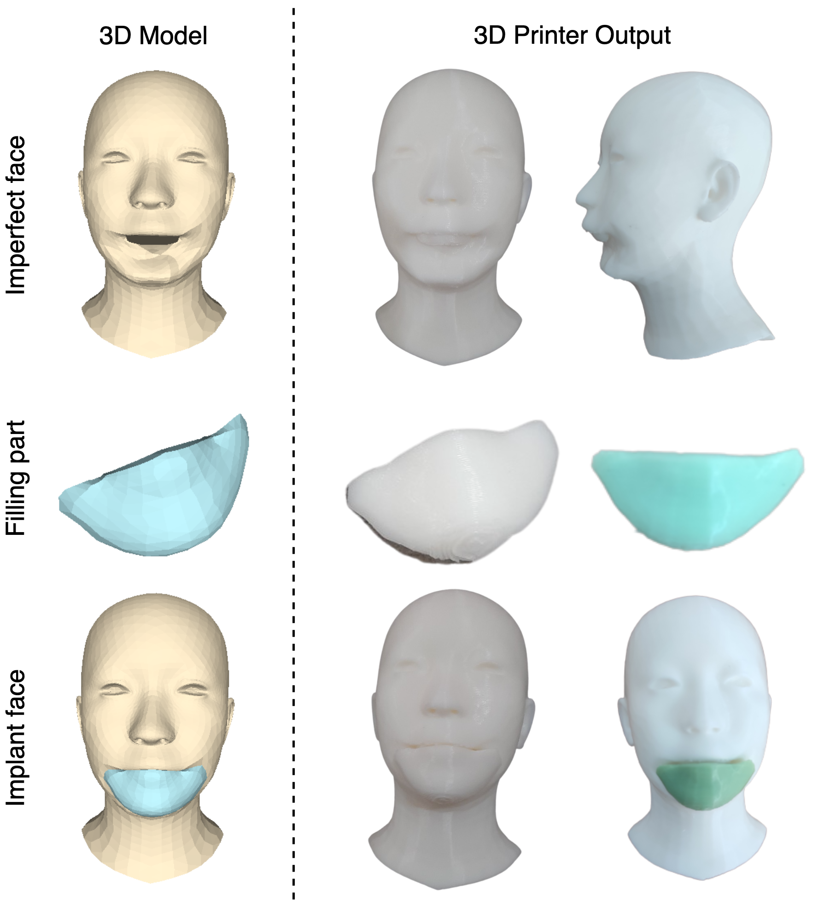

## 3D-Scar-Face-Restoration
This repository contains the implementation (in PyTorch) of the paper




## Introduction
Base on the study of Zhou et al., we try to apply that model in a reality case. To do that, we try provide a training strategy and a new dataset to help Zhou et al., model can apply in restoration problem.

## Usage
### 1. Environment
For compiling and running the C++ project in *GraphSampling*, you need to install cmake, ZLIB and opencv.

For running the python code in GraphAE, Zhou et al., recommend python3.6, numpy, pytorch0.4.1 or higher version such as pytorch1.3, plyfile, json, configparser, tensorboardX, matplotlib, transforms3d and opencv-python.

### 2. Data Preparation
Download data:
[Google Drive](https://drive.google.com/drive/folders/1IMmmzMVcdPApgFzSrTjanyH-jgRsTSB-?usp=share_link)

- <em>train</em> contain weight file training of our paper
- <em>data</em> contain train and eval data after preprocessing
- <em>original_data</em> contain original obj type data


### 2. GraphSampling
This code will load template.obj, compute the down and up-sampling graphs and write the *connection matrices* for each layer into .npy files.

For compiling and running the code, go to "code/GraphSampling", open the terminal, run
```
cmake .
make
./GraphSampling
```

It will generate the *Connection matrices* for each sampling layer named as _poolX.npy or _unpoolX.npy and their corresponding obj meshes for visualization in "train/graphAE_cirtech/ConnectionMatrices".

### 3. Network Training
#### Step One: Create Configuration files.
Create a configuration file in the training folder. We put a examples 10_conv_pool.config in "train/graphAE_cirdata/".

By setting the attributes of *connection_layer_lst*, *channel_lst*, *weight_num_lst* and *residual_rate_lst*, you can freely design your own network architecture with all or part of the connection matrices we generated previously. But make sure the sizes of the output and input between two layers match.

#### Step Two: Training
Open graphAE_train.py, modify line 188 to the path of the configuration file, and run
```
python graphAE_train_Xy.py
```

It will save the temporal results, the network parameters and the tensorboardX log files in the directories written in the configuration file.

#### Step Three: Testing
Open graphAE_test.py, modify the paths and run
```
python graphAE_test.py
```

## Citation

This code built base on Zhou et al,. github code:
```
https://github.com/papagina/MeshConvolution
```

If you use our code, models or wish to refer to our results and the Zhou et al. results, please use the following BibTex entry:
```
@InProceedings{Yi_2020_ARXIV,
  author = {Zhou, Yi and Wu, Chenglei and Li, Zimo and Cao, Chen and Ye, Yuting and Saragih, Jason and Li, Hao and Sheikh, Yaser},
  title = {Fully Convolutional Mesh Autoencoder using Efficient Spatially Varying Kernels},
  booktitle = {arxiv},  
  year = {2020}
}
```
